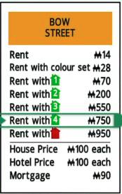
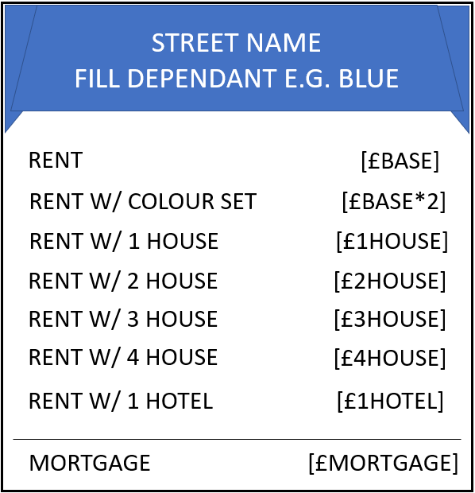
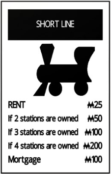
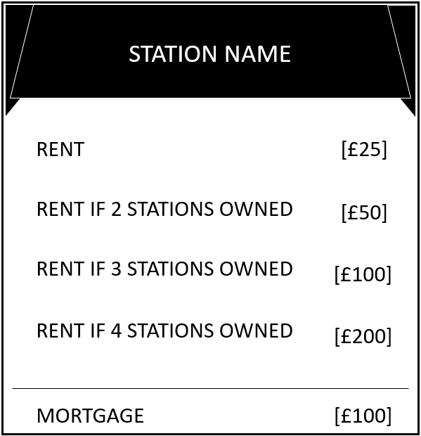
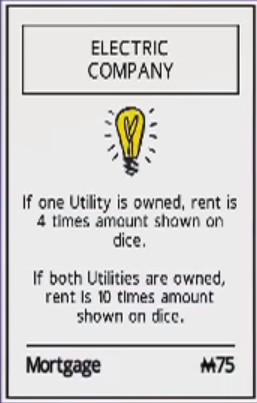
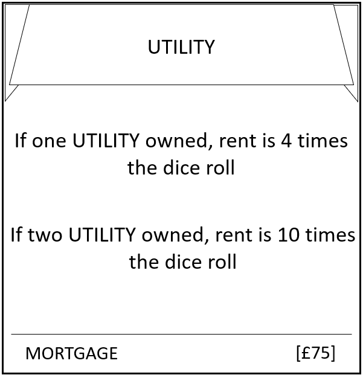
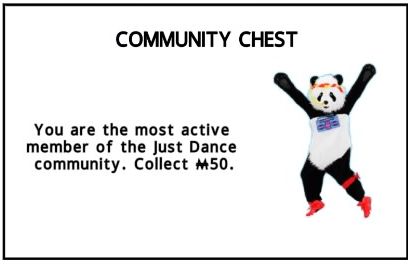
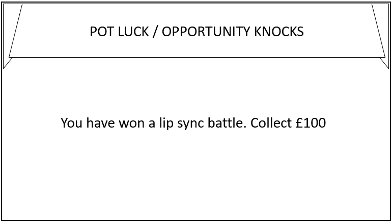

<h1>Rough Card Design</h1>
<h2>Strictly Visual NOT Implementation</h2>

The infamous monopoly cards were a perfect start for a rough card design of the property tycoon cards. All properties, stations, utilities, pot luck and opportunity cards had the same base card design, however as they have different behaviours to them, they have slight differences in the design

Although monopoly is a board game, with looking at the specification it was clear that property tycoon would be an electronic version, rather than the traditional physical board. Due to this I did used my prior knowledge of the PlayStation 4 game to get an idea of what the cards may look like. I just google searched for the type of card I was looking for followed by 'monopoly ps4'.

    

        

        <h3>Street Card</h3>
        The image I got from google: 
         
        The image I've designed: 
        
        

        

        <h3>Station Card</h3>
        The image I got from google: 
         
        The image I've designed: 
        
        

    

    

        <h3>Utility Card</h3>
        The image I got from google: 
         
        The image I've designed: 
        
    

    <h3>Pot Luck / Opportunity Knocks</h3>
    The image I got from google: 
     
    The image I've designed: 
    

<h2>Design Choices</h2>
I thought in order to make the cards a bit more unique I changed the style of the 'header' but I did keep the same colour scheme as I think it works perfectly.

The station, utility, community chest and chance cards from the ps4 version have images in them, I didn't have images in mine as non-copyright images I found online didn't fit right. However I would like to add images to them as I believe it is more engaging and overall better quality with images.

I would also like to change the font of my designs as they are not very exciting/engaging, I used the default font as my designs are rough and about structure more than specific design.
